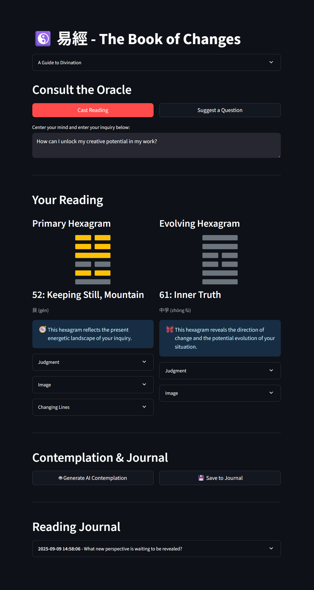

# I Ching Reading Streamlit App ☯️

[](https://www.python.org/downloads/)
[](https://streamlit.io)
[](https://opensource.org/licenses/MIT)

A modern and interactive web application for casting and interpreting the I Ching (易經), the ancient Chinese "Book of Changes." This app provides a digital way to consult the oracle, offering wisdom and insight through its timeless hexagrams. It features classic interpretations, an optional AI-powered contemplation for a more contemporary perspective, and a personal journal to record and reflect on your readings.

## 📸 Screenshots



## ✨ Features

*   **Interactive Hexagram Casting:** Simply focus on a question and click to cast a reading.
*   **Primary and Evolving Hexagrams:** The app displays the primary hexagram for your current situation and, if applicable, the evolving hexagram that indicates the direction of change.
*   **Detailed Classical Interpretations:** Access the traditional texts for each hexagram, including:
    *   **Judgment:** The overall meaning of the hexagram.
    *   **Image:** The symbolism of the trigrams that form the hexagram.
    *   **Changing Lines:** Specific advice for lines that are in a state of transformation.
*   **Bilingual Display:** All classical texts are presented in both English and the original Chinese.
*   **AI-Powered Contemplation (Optional):** Leverage the power of modern AI to receive a thoughtful, personalized interpretation of your reading, weaving together the various elements of the hexagrams into a cohesive narrative.
*   **Reading Journal:** Save your readings to a personal journal to track your journey and reflect on the guidance you've received over time.
*   **Suggest a Question:** If you're unsure what to ask, the app can suggest a question to help you get started.
*   **Responsive Design:** The app is designed to work on both desktop and mobile devices.

## 📖 About the I Ching

The I Ching, or Book of Changes, is an ancient divination text that has been used for centuries as a source of wisdom and guidance. It is based on the concept of yin and yang, represented by broken and solid lines, which are combined to form 64 hexagrams. Each hexagram has a unique meaning and offers insight into the energies at play in a given situation.

## 🚀 How It Works

The application simulates the traditional method of casting I Ching hexagrams using yarrow stalks or coins.

1.  **Casting the Lines:** The app randomly generates six numbers, each representing a line in the hexagram. The numbers 6, 7, 8, and 9 correspond to the different types of lines (yin, yang, changing yin, changing yang).
2.  **Determining the Hexagrams:**
    *   The six lines form the **primary hexagram**, which reflects the present moment.
    *   If any of the lines are "changing" (a 6 or a 9), they transform into their opposite, creating a **secondary (or evolving) hexagram**. This second hexagram provides insight into how the situation is likely to unfold.
3.  **Displaying the Reading:** The app looks up the corresponding hexagrams in the `i_ching_data.json` file and displays the relevant texts and images.
4.  **AI Interpretation:** If an OpenAI API key is provided, the app sends the user's question and the details of the reading to the OpenAI API. It then displays the AI-generated interpretation, which offers a modern perspective on the classical reading.
5.  **Journaling:** Readings can be saved to a local CSV file (`i_ching_journal.csv`), allowing you to revisit them later.

## 🛠️ Technologies Used

*   **Frontend:** [Streamlit](https://streamlit.io/)
*   **Backend:** Python
*   **AI:** [OpenAI API](https://beta.openai.com/docs/)
*   **Data:** `i_ching_data.json` (custom data file), `i_ching_journal.csv` (local journal)

## ⚙️ Installation and Usage

To run this application locally, follow these steps:

1.  **Clone the repository:**
    ```bash
    git clone https://github.com/your-username/i-ching-reading-streamlit-app.git
    cd i-ching-reading-streamlit-app
    ```
    *(Replace `your-username` with your actual GitHub username if you fork the repository)*

2.  **Create and activate a virtual environment (recommended):**
    ```bash
    python -m venv venv
    source venv/bin/activate  # On Windows, use `venv\Scripts\activate`
    ```

3.  **Install the dependencies:**
    ```bash
    pip install -r requirements.txt
    ```

4.  **Set up your OpenAI API Key (Optional):**
    To use the AI-powered contemplation feature, you need an OpenAI API key.
    *   Create a file named `.env` in the root of the project.
    *   Add your API key to the `.env` file as follows:
        ```
        OPENAI_API_KEY='your-api-key-here'
        ```

5.  **Run the Streamlit app:**
    ```bash
    streamlit run app.py
    ```
    The application will open in your default web browser.

## 📂 Project Structure

```
.
├── .gitignore
├── app.py                  # The main Streamlit application
├── ai_integration.py       # Handles communication with the OpenAI API
├── constants.py            # Stores constant values like sample questions
├── file_handler.py         # Manages loading data and saving journal entries
├── i_ching_data.json       # Data for the 64 hexagrams
├── iching_logic.py         # Core logic for casting and determining hexagrams
├── requirements.txt        # Python dependencies
├── ui_components.py        # Functions for creating Streamlit UI elements
└── README.md               # This file
```

## 🤝 Contributing

Contributions are welcome! If you have any ideas for improvements or new features, feel free to open an issue or submit a pull request.

1.  Fork the Project
2.  Create your Feature Branch (`git checkout -b feature/AmazingFeature`)
3.  Commit your Changes (`git commit -m 'Add some AmazingFeature'`)
4.  Push to the Branch (`git push origin feature/AmazingFeature`)
5.  Open a Pull Request

## 📄 License

This project is licensed under the MIT License.